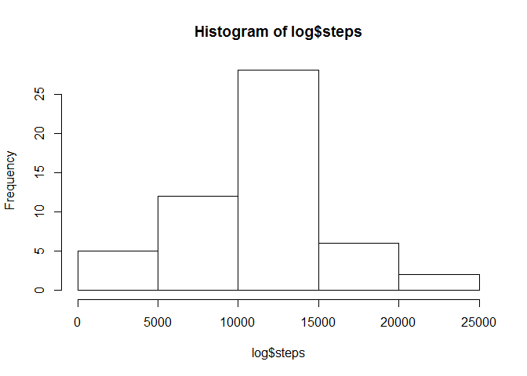
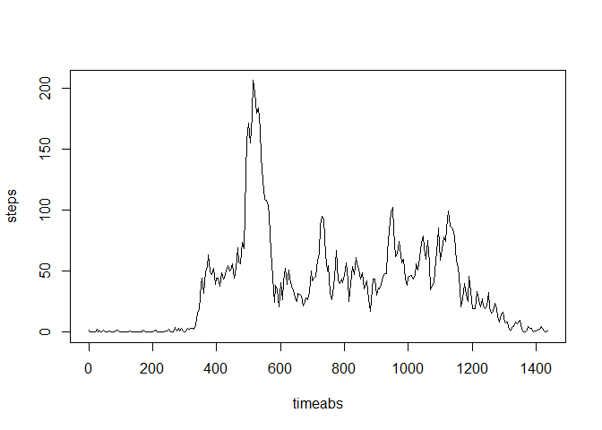
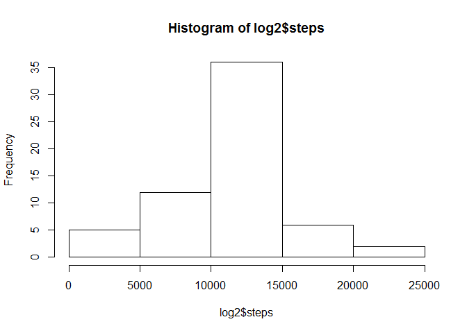
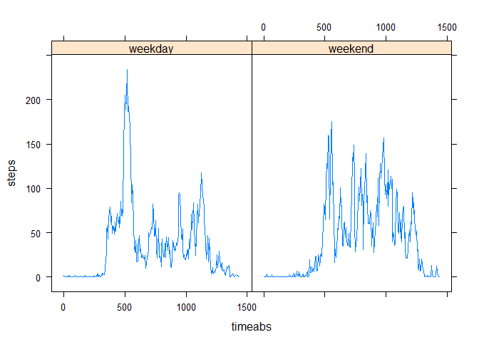

# Assignment 1
Nathan Zeitler  
Wednesday, May 13, 2015  

The frist step to exploring the fit bit data set downloaded from https://d396qusza40orc.cloudfront.net/repdata%2Fdata%2Factivity.zip is to load in the data.


```r
options(scipen=999)
library(plyr)
## extracts file is zip is present but file is not
	if (file.exists("repdata_data_activity.zip")&!file.exists("repdata_data_activity")){
    unzip ("repdata_data_activity.zip")
}

## read file using read.csv function.  
setwd("repdata_data_activity")
dat <- read.csv("activity.csv")
```
The next step is to prepare the data for displaying, including changing the date column to a POSIXct type and adding in new coloumns to help summarize the data.

```r
## make chnges to the data set to allow for easier later porcessing.  This includes converting date into a POSIXct data type and and adding a column to label each data point as belonging to a weekday or a weekend day.
dat$datefact <- dat$date
dat$date <- as.POSIXlt(dat$date)
dat$week <- weekdays(dat$date)
## generate week/weekend column
for (i in 1:length(dat$week)){
  if (dat$week[i] == "Saturday" | dat$week[i]  =="Sunday"){
    dat$week[i] <- "weekend"}
  else { dat$week[i]<- "weekday"}
  }
dat$week <- as.factor(dat$week)
dat$timeabs <- rep(c(seq(0,1435,5)),61)
str(dat)
```

```
## 'data.frame':	17568 obs. of  6 variables:
##  $ steps   : int  NA NA NA NA NA NA NA NA NA NA ...
##  $ date    : POSIXlt, format: "2012-10-01" "2012-10-01" ...
##  $ interval: int  0 5 10 15 20 25 30 35 40 45 ...
##  $ datefact: Factor w/ 61 levels "2012-10-01","2012-10-02",..: 1 1 1 1 1 1 1 1 1 1 ...
##  $ week    : Factor w/ 2 levels "weekday","weekend": 1 1 1 1 1 1 1 1 1 1 ...
##  $ timeabs : num  0 5 10 15 20 25 30 35 40 45 ...
```

The nexts step is to begin analysis.  In this case we will first look at the total number of steps per day.  For this we are ignoring any days without data. 

```r
## use plyr package loaded in the begning to generagte sum based on date
log <- ddply(dat,.(datefact),summarize,steps=sum(steps, na.rm=FALSE))
#3 generate a histogram and show the mean and median total steps per day.
hist(log$steps)
```

 

```r
m1 <- mean(log$steps,na.rm=TRUE)
md1 <- median(log$steps,na.rm=TRUE)
```
So the mean is 10766.1886792 and the median is 10765.  Given how close these value are the data must be roughly equaly distributed about the mean.

Now we will investigate the average number of steps walked in each 5 minute time interval.  Again for this section we are ignoring NA data points.

```r
## use plyr package to create mean for each time interval
mean_by_time <- ddply(dat,.(timeabs),summarize,steps=mean(steps,na.rm=T))
## plot and determine max number of average steps
plot(mean_by_time, type="l")
```

 

```r
max(mean_by_time)
```

```
## [1] 1435
```
Now there are some days with no data recorded.  We will fill these days in by setting each NA value to the average value for that interval on all other days, and repeat the summary analysis from part 1.

```r
## determine number of NA values
sum(is.na(dat$steps))
```

```
## [1] 2304
```

```r
## replace each NA with the average value for that time interval on all days.
dat2 <- dat
for (i in 1:length(dat2$date)){
  if (is.na(dat2$steps[i])){
    dat2$steps[i] <- mean_by_time$steps[mean_by_time$timeabs==dat2$timeabs[i]]
  }
}

## use dplyr to create sums and produce output
log2 <- ddply(dat2,.(datefact),summarize,steps=sum(steps))
hist(log2$steps)
```

 

```r
m2 <- round(mean(log2$steps), 6)
md2 <- round(median(log2$steps),6)
```
THe mean of the corrected data is 10766.188679 and the median of the corrected data is 10766.188679.  THe strategy we used to fill in the missing data effectivly added 
rougly 8 days at exactly the mean value.  Thus while the mean did not change, the median moved over some number of days so that it fell on the day we added at the average.


Finaly we will compare the step paterns on weekdays and the step paterns on weekend by comparing the average steps at each interval. 

```r
library(lattice)
log3 <- ddply(dat,.(timeabs,week),summarize,steps=mean(steps,na.rm=T))
xyplot(steps ~ timeabs | week, data=log3, type="l")
```

 

The overall patern seems to indicate that on weekdays there is a distinc spike in distance traveled (as measured by steps) fairly early in the morning 
